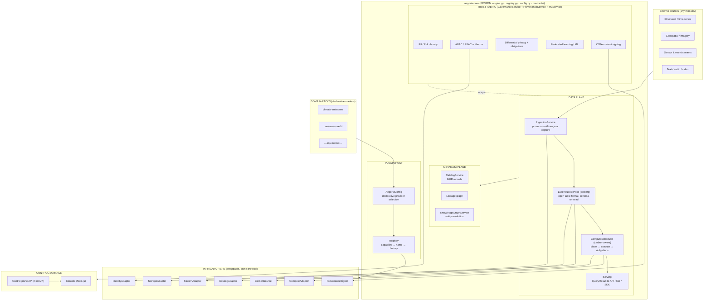
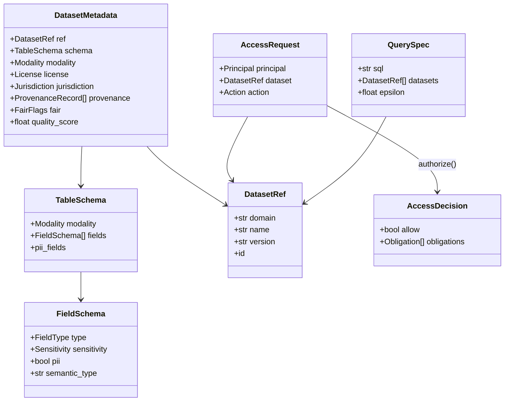
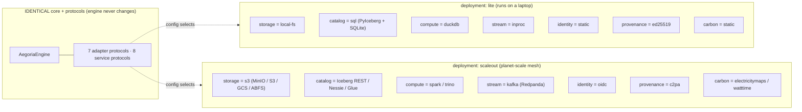
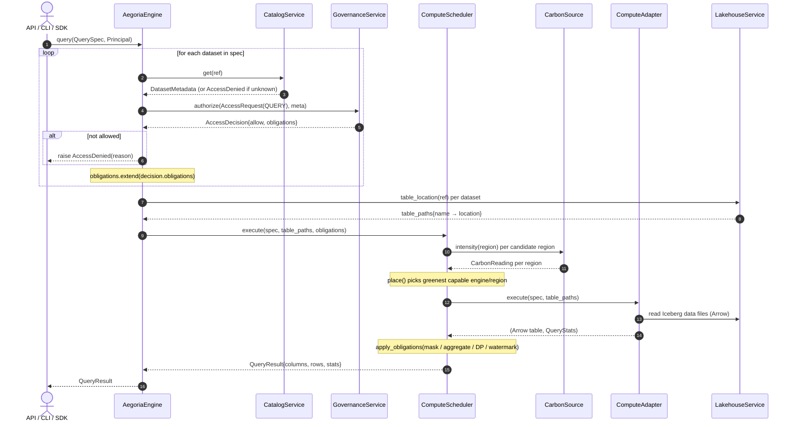
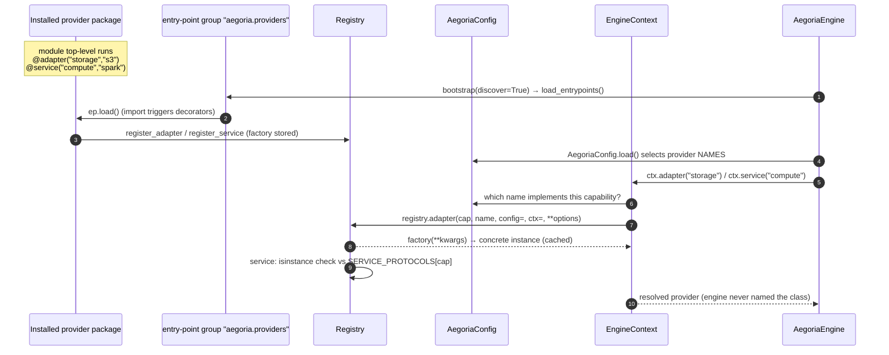

# Aegoria — Architecture

Aegoria is a planet-scale, **market-agnostic**, privacy-preserving big-data
**lakehouse** platform. It ingests heterogeneous, multi-modal data into an open
table format over object storage, attaches machine-readable provenance, lineage
and licensing at the moment of capture, governs every byte with a privacy-first
trust fabric, and executes governed queries on a **carbon-aware scheduler**.

This document is the high-level map. It is written against the *actual* code in
this repository; every component links to the file that implements or specifies
it. Two companion documents go deeper:

- [Domain-Pack Specification](../reference/domain-pack-spec.md) — how a market onboards declaratively.
- [Adapter & Service Interfaces](../reference/adapter-interfaces.md) — how a new infra backend plugs in.

---

## The one invariant

> **The core engine never changes** when you add a domain or an infra backend.

Mechanically, this is guaranteed by three things working together:

1. **Protocols, not classes.** The engine binds only to the abstract contracts in
   [`engine/aegoria_core/contracts/`](../../engine/aegoria_core/contracts/) —
   `models.py` (the data vocabulary), `adapters.py` (infra seams),
   `services.py` (platform capabilities) and `domain_pack.py` (the market
   manifest). It imports **no** concrete implementation.
2. **A registry of factories.** Concrete adapters, services and domain-packs
   register *factories* in the
   [`Registry`](../../engine/aegoria_core/registry.py) keyed by
   `capability + provider name`. The engine resolves what
   [`AegoriaConfig`](../../engine/aegoria_core/config.py) selects — it never
   names a class.
3. **Entry-point discovery.** `Registry.load_entrypoints()` discovers providers
   shipped by *installed packages* via the `aegoria.providers` Python entry-point
   group. A new cloud or a new market is an installable package, not a code edit.

The orchestrator, [`AegoriaEngine`](../../engine/aegoria_core/engine.py), states this
in its own docstring: *"It imports no concrete adapter, service or domain-pack."*
Adding a market is `load_domain_pack(manifest) + data`; adding a cloud/format is
registering a new adapter. Neither edits the engine. See
[The "core never changes" guarantee](#the-core-never-changes-guarantee-mechanically)
for the mechanical walk-through.

---

## C4-ish system overview

The platform decomposes into a **data plane** (move + store + compute), a **trust
fabric** (classify + authorize + privatize + sign) wrapped around it, a
**metadata plane** (catalog + lineage + knowledge graph), a **plugin host**
(registry + adapters + domain-packs), and a **control surface** (control-plane
API + console).

### Component breakdown

| Layer | Component | Implements / specifies | Stability |
|------|-----------|------------------------|-----------|
| Core | [`AegoriaEngine`](../../engine/aegoria_core/engine.py) | Orchestrates ingest / govern / schedule / query flows | **Frozen** |
| Core | [`Registry`](../../engine/aegoria_core/registry.py) | `capability → name → factory` resolution + entry-point discovery | **Frozen** |
| Core | [`AegoriaConfig`](../../engine/aegoria_core/config.py) | Declarative provider selection + privacy/carbon defaults | **Frozen** |
| Core | [`contracts/models.py`](../../engine/aegoria_core/contracts/models.py) | The data vocabulary (datasets, schemas, access, privacy, query, KG) | **Frozen** |
| Core | [`contracts/adapters.py`](../../engine/aegoria_core/contracts/adapters.py) | 7 infra adapter protocols | **Frozen** |
| Core | [`contracts/services.py`](../../engine/aegoria_core/contracts/services.py) | 8 platform service protocols + `SERVICE_PROTOCOLS` | **Frozen** |
| Core | [`contracts/domain_pack.py`](../../engine/aegoria_core/contracts/domain_pack.py) | The declarative `DomainPackManifest` | **Frozen** |
| Services | [`services/lakehouse.py`](../../engine/aegoria_core/services/lakehouse.py) | `iceberg` lakehouse over catalog + storage adapters | Swappable |
| Services | [`services/catalog.py`](../../engine/aegoria_core/services/catalog.py) | `default` FAIR catalog + lineage (SQLite) | Swappable |
| Services | governance · ingestion · scheduler · knowledge_graph · ml · provenance | the remaining reference services | Swappable |
| Adapters | [`adapters_builtin/`](../../engine/aegoria_core/adapters_builtin/) | the 7 *lite* reference adapters | Swappable |
| Markets | [`domain-packs/`](../../domain-packs/) | `climate-emissions`, `consumer-credit` | Pluggable data |
| Control | [`control-plane/control_plane/app.py`](../../control-plane/control_plane/app.py) | FastAPI REST surface for the console | Swappable |
| Control | [`apps/console`](../../apps/console) | Next.js operator console | Swappable |
| Tooling | [`sdk/aegoria_sdk`](../../sdk/aegoria_sdk) | scaffold / validate / lint / test domain-packs | Swappable |

> The registry validates services against their protocol at construction time:
> `Registry.service()` checks `isinstance(instance, SERVICE_PROTOCOLS[capability])`
> and raises `ProtocolViolation` if a provider does not satisfy the contract.
> This is why a wrong implementation fails loudly at wiring time, not at runtime.

---

## The data vocabulary (`contracts/models.py`)

Everything in the platform speaks one **domain-neutral** vocabulary. A dataset of
satellite imagery, of credit applications, of ICU vitals or of freight telemetry
is the *same kind of object* to the core. Domain meaning enters only through
`semantic_type` links into a domain-pack's ontology — never hard-coded.

Key types (see [`models.py`](../../engine/aegoria_core/contracts/models.py)):

- **`Modality`** — the *shape* of data independent of meaning: `structured`,
  `time_series`, `geospatial`, `imagery`, `sensor_stream`, `event_stream`,
  `text`, `audio`, `video`, `graph`.
- **`Sensitivity`** — drives default policy: `public`…`pii`/`phi`/`financial`/`restricted`.
- **`DatasetRef`** — the stable, domain-qualified pointer: `domain/name@version`.
- **`Provenance` / `Lineage`** — `ProvenanceRecord` (capture-time, signable) and
  `LineageEdge` (graph of operations) attach trust at ingest.
- **`Principal` / `AccessRequest` / `AccessDecision` / `Obligation`** — the ABAC
  request/response shapes; obligations are conditions the platform *must* enforce
  (`mask`, `tokenize`, `differential_privacy`, `aggregate_only`, `row_filter`,
  `watermark`, `residency`).
- **`PrivacyBudget`** — per-`(principal, dataset)` (ε, δ) DP accounting.
- **`QuerySpec` / `QueryResult` / `QueryStats`** — the query surface, including
  `energy_kwh`, `carbon_g`, `dp_applied`, `epsilon_spent`.
- **`CarbonReading`** — grid carbon intensity per region for the scheduler.
- **`Entity` / `Relation`** — the cross-domain knowledge graph.

---

## Deployment topologies — *lite* vs *scale-out*

The **same engine** becomes a laptop lakehouse or a multi-cloud mesh **purely by
changing which providers the config selects**. The adapter/service protocols are
identical across both; only the registered provider names differ.

- **lite** (`deployment: lite`, the default) — a complete lakehouse on one
  machine: `local-fs` warehouse, PyIceberg **SQL/SQLite** catalog, **DuckDB**
  compute, in-process pub/sub, dev identity, stdlib content signing, static
  carbon table. Defined entirely by [`config.py`](../../engine/aegoria_core/config.py)
  defaults and implemented in [`adapters_builtin/`](../../engine/aegoria_core/adapters_builtin/).
- **scale-out** (`deployment: scaleout`) — the *same* adapters point at real
  infra: **MinIO/S3** object store, **Iceberg REST + Nessie** catalogs,
  **Spark/Trino** compute, **Redpanda** (Kafka API) streaming, **Dagster**
  orchestration. This is purely a *deployment* concern; see the opt-in
  `scaleout` profile in
  [`deploy/docker-compose.yml`](../../deploy/docker-compose.yml) and
  [`deploy/k8s/`](../../deploy/k8s/). The compose file's own header states the
  invariant: *"the core engine never changes when you swap infra."*

The mapping (lite name → scale-out backend) is documented per-protocol in
[Adapter & Service Interfaces](../reference/adapter-interfaces.md).

---

## Query flow — authorize → place → execute → obligations

`AegoriaEngine.query(spec, principal)` is the canonical governed read path
([`engine.py`](../../engine/aegoria_core/engine.py)). It is pure orchestration over
service protocols: for each dataset it authorizes the principal, collects
obligations, resolves physical table locations, then hands placement + execution
+ obligation enforcement to the carbon-aware scheduler.

**Step semantics** (each numbered phase maps to real code):

1. **Authorize.** For every `DatasetRef` in the spec, the engine loads the FAIR
   record via `CatalogService.get`; an unknown dataset raises `AccessDenied`. It
   builds an `AccessRequest(action=QUERY)` and calls
   `GovernanceService.authorize`. A `deny` decision raises `AccessDenied`; an
   `allow` contributes its `Obligation`s to the run.
2. **Place.** `ComputeScheduler.place` consults `CarbonSource.intensity` across the
   `ComputeAdapter.regions` to choose the **greenest capable** engine/region,
   returning `{engine, region, estimated_carbon_g, reason}`.
3. **Execute.** `ComputeAdapter.execute(spec, table_paths)` runs the SQL over the
   lakehouse data files and returns an Arrow table plus `QueryStats`
   (rows, bytes scanned, duration, engine, region).
4. **Obligations.** `GovernanceService.apply_obligations` enforces the collected
   obligations (mask / tokenize / aggregate-only / differential privacy /
   watermark / residency) on the result **before** it is materialized. DP runs
   here also debit the `PrivacyBudget`.

The write/ingest path is the mirror image: `AegoriaEngine.ingest(...)` validates
the dataset is declared by a loaded pack, calls `IngestionService.ingest`
(which attaches provenance + lineage at capture), and records a lineage edge from
the source connector to the new dataset version.

---

## The "core never changes" guarantee, mechanically

The constraint is not a convention — it is enforced by the code structure. Here is
the exact chain that makes adding a backend or a market a zero-core-edit change.

1. **Registration is decentralized.** A provider self-registers on import via
   `@adapter(capability, name)` / `@service(capability, name)` /
   `@domain_pack(id)` — see the decorators in
   [`registry.py`](../../engine/aegoria_core/registry.py). The engine never imports
   the module that defines the class.
2. **Discovery is automatic.** `AegoriaEngine.bootstrap(discover=True)` calls
   `load_entrypoints("aegoria.providers")`. Each installed package advertising
   that entry-point group has its module imported, which fires its registration
   decorators. (The *lite* providers register the same way via
   [`adapters_builtin/__init__.py`](../../engine/aegoria_core/adapters_builtin/__init__.py)
   and [`services/__init__.py`](../../engine/aegoria_core/services/__init__.py).)
3. **Selection is declarative.** `AegoriaConfig` maps each capability to a
   provider *name* (plus construction `options`). Defaults are the lite names;
   a YAML file or `AEGORIA_CONFIG` env var overrides them. Nothing in the engine
   hard-codes a name.
4. **Resolution is lazy + cached.** `EngineContext.adapter(cap)` /
   `.service(cap)` read the configured name, ask the registry for the factory,
   and call it with `config`/`ctx`/`options`. Results are cached so providers can
   depend on each other without ordering. Factories receive `ctx`, so a service
   gets infra via `ctx.adapter("storage")` and peers via `ctx.service("governance")`.
5. **Contracts are enforced.** `Registry.service()` `isinstance`-checks the
   constructed service against `SERVICE_PROTOCOLS[capability]` (the protocols are
   `@runtime_checkable`) and raises `ProtocolViolation` on a mismatch.
6. **Markets are data.** `AegoriaEngine.load_domain_pack(manifest)` registers a
   market's datasets, policies, ontology and model refs purely by calling service
   protocols — `_check_compat` first verifies `manifest.core_compat` against
   `CORE_VERSION` using semver. No market word ever enters the engine.

**Net effect:** to add a cloud you ship an adapter package and flip a name in
config; to add an industry you write a `manifest.yaml`. The files under
[`engine/aegoria_core/`](../../engine/aegoria_core/) marked *Frozen* above are never
touched.

---

## Control plane & console

The control-plane ([`control-plane/control_plane/app.py`](../../control-plane/control_plane/app.py))
is a thin **FastAPI** surface that bootstraps a single `AegoriaEngine` on startup
and exposes the console's view-models over read-mostly REST plus two write
endpoints (`POST /query`, `POST /ingest`). It is deliberately **resilient**: every
read endpoint degrades to a valid, possibly-derived payload and never 500s on a
service that has not yet been wired through the registry (genuine bad input still
returns 4xx). Key endpoints: `/health`, `/overview`, `/datasets`, `/packs`,
`/lineage`, `/policies`, `/privacy/budgets`, `/carbon`, `/queries`, `/pipelines`,
`/graph`, `/kpis`.

The **console** ([`apps/console`](../../apps/console)) is a Next.js operator UI
(catalog, lineage, governance, trust, carbon, query, packs, graph, pipelines). It
renders on built-in fixtures and can be pointed at the live API via
`AEGORIA_API_URL`.

Both run from [`deploy/docker-compose.yml`](../../deploy/docker-compose.yml) (lean
`console + api` by default; opt-in `scaleout` profile for the full mesh) and
[`deploy/k8s/`](../../deploy/k8s/).

---

## Glossary

| Term | Meaning |
|------|---------|
| **Adapter** | A provider for an *infra* protocol (storage, catalog, compute, stream, identity, provenance, carbon). |
| **Service** | A provider for a *platform capability* protocol (lakehouse, ingestion, catalog, governance, scheduler, knowledge_graph, ml, provenance). |
| **Domain-pack** | A declarative, versioned manifest that onboards a market as data. |
| **Capability** | The slot a provider fills (e.g. `"storage"`, `"governance"`). |
| **Provider name** | The registered key for one implementation of a capability (e.g. `"local-fs"`, `"s3"`). |
| **Obligation** | A condition the platform must enforce on granted access (mask, DP, watermark, residency…). |
| **Modality** | The shape of data independent of its meaning. |
| **FAIR** | Findable, Accessible, Interoperable, Reusable — tracked per dataset in `FairFlags`. |
