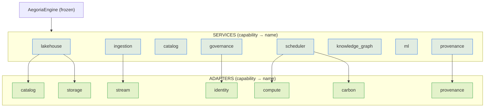
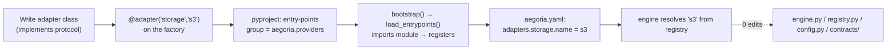

# Aegoria — Adapter & Service Interfaces

This document specifies every **adapter** (infra seam) and **service** (platform
capability) protocol the Aegoria core binds to, the *lite* reference
implementation of each, and exactly **how to add a new backend without touching
the core**. It is authoritative against:

- [`contracts/adapters.py`](../../engine/aegoria_core/contracts/adapters.py) — 7 adapter protocols.
- [`contracts/services.py`](../../engine/aegoria_core/contracts/services.py) — 8 service protocols + `SERVICE_PROTOCOLS`.
- [`registry.py`](../../engine/aegoria_core/registry.py) — registration + resolution.
- [`config.py`](../../engine/aegoria_core/config.py) — provider selection + default names.

> **Adapters** sit *below* the engine and abstract infrastructure (storage,
> catalog, compute, broker, IdP, signer, carbon). **Services** are *domain-neutral
> platform capabilities* that may *use* adapters but never encode domain meaning.
> The engine resolves both by capability + name from the registry and never
> imports a concrete class.



---

## Factory signatures (the contract the engine calls)

Providers register a **factory** via decorators in
[`registry.py`](../../engine/aegoria_core/registry.py). The engine calls these with a
fixed keyword signature:

```python
# Adapter factory — registered with @adapter(capability, name)
def make_x(*, config: AegoriaConfig, ctx: EngineContext, **options) -> XAdapter: ...

# Service factory — registered with @service(capability, name)
def make_y(*, ctx: EngineContext) -> YService: ...
```

- `EngineContext.adapter(cap)` resolves the configured adapter name, then calls
  `registry.adapter(cap, name, config=config, ctx=self, **selection.options)`.
- `EngineContext.service(cap)` calls `registry.service(cap, name, ctx=self)` and
  then **`isinstance`-checks** the result against `SERVICE_PROTOCOLS[cap]`,
  raising `ProtocolViolation` on a mismatch.
- Inside a service: get infra via `ctx.adapter("storage")` etc., and peer services
  via `ctx.service("governance")` etc. Results are cached on the context, so
  providers may depend on each other without ordering concerns.

Default provider names (from [`config.py`](../../engine/aegoria_core/config.py)):

| Capability kind | Capability | Default name | Lite impl |
|-----------------|-----------|--------------|-----------|
| adapter | `storage` | `local-fs` | [`storage_localfs.py`](../../engine/aegoria_core/adapters_builtin/storage_localfs.py) |
| adapter | `catalog` | `sql` | [`catalog_sql.py`](../../engine/aegoria_core/adapters_builtin/catalog_sql.py) |
| adapter | `compute` | `duckdb` | [`compute_duckdb.py`](../../engine/aegoria_core/adapters_builtin/compute_duckdb.py) |
| adapter | `stream` | `inproc` | [`stream_inproc.py`](../../engine/aegoria_core/adapters_builtin/stream_inproc.py) |
| adapter | `identity` | `static` | [`identity_static.py`](../../engine/aegoria_core/adapters_builtin/identity_static.py) |
| adapter | `provenance` | `ed25519` | [`provenance_ed25519.py`](../../engine/aegoria_core/adapters_builtin/provenance_ed25519.py) |
| adapter | `carbon` | `static` | [`carbon_static.py`](../../engine/aegoria_core/adapters_builtin/carbon_static.py) |
| service | `lakehouse` | `iceberg` | [`services/lakehouse.py`](../../engine/aegoria_core/services/lakehouse.py) |
| service | `catalog` | `default` | [`services/catalog.py`](../../engine/aegoria_core/services/catalog.py) |
| service | `ingestion` | `default` | `services/ingestion.py` |
| service | `governance` | `default` | `services/governance.py` |
| service | `scheduler` | `carbon-aware` | `services/scheduler.py` |
| service | `knowledge_graph` | `default` | `services/knowledge_graph.py` |
| service | `ml` | `default` | `services/ml.py` |
| service | `provenance` | `default` | `services/provenance.py` |

---

## Adapter protocols

All seven are `@runtime_checkable` `Protocol`s with a `name: str` attribute. Lite
↔ scale-out mappings come from [`deploy/docker-compose.yml`](../../deploy/docker-compose.yml).

### `StorageAdapter` — object/file storage

Backs the lakehouse warehouse (local-fs, S3, GCS, ABFS).

| Method | Purpose |
|--------|---------|
| `put(key, data, content_type) -> str` | Write object; returns its URI. |
| `get(key) -> bytes` | Read object. |
| `exists(key) -> bool` / `delete(key)` | Existence / removal. |
| `list(prefix) -> Iterable[str]` | List keys under a prefix. |
| `uri(key) -> str` | Durable handle for a key. |
| `presign(key, expires_s) -> str` | Signed URL for offline/edge sync (may be a plain URI offline). |

**Lite:** [`LocalFsStorage`](../../engine/aegoria_core/adapters_builtin/storage_localfs.py) maps
bucket-style keys to paths under `config.warehouse_uri`, guards against path
traversal, and returns `file://` URIs from `presign`.

**Scale-out:** an `s3` adapter over MinIO/S3 (see the `minio` compose service).

### `CatalogAdapter` — table catalog

Namespaces + table metadata pointers (Iceberg REST, Nessie, SQL, Glue).

| Method | Purpose |
|--------|---------|
| `create_namespace(ns)` / `list_namespaces()` | Manage namespaces (one per domain). |
| `create_table(ref, schema, location) -> str` | Create an Iceberg table; returns location. |
| `load_table(ref) -> Any` | Engine-native table handle. |
| `table_exists(ref) -> bool` | Existence. |
| `commit(ref, snapshot)` | Stamp commit metadata. |
| `list_tables(namespace) -> DatasetRef[]` | Enumerate tables. |

**Lite:** [`SqlCatalogAdapter`](../../engine/aegoria_core/adapters_builtin/catalog_sql.py)
wraps `pyiceberg.catalog.sql.SqlCatalog` (SQLite file at `config.catalog_uri`,
data under `config.warehouse_uri`). It maps the core `FieldType` vocabulary onto
pyiceberg types (geometry/JSON/array/struct degrade to string in lite).

**Scale-out:** Iceberg REST or Nessie (`iceberg-rest`, `nessie` compose services).

### `ComputeAdapter` — query/plan execution

Executes SQL/logical plans over lakehouse tables (DuckDB, Spark, Trino, Ray). Has
a `regions: list[str]` attribute used by the carbon-aware scheduler.

| Method | Purpose |
|--------|---------|
| `execute(spec, table_paths) -> (pa.Table, QueryStats)` | Run the query; return Arrow + stats incl. bytes scanned. |
| `estimate(spec, table_paths) -> QueryStats` | Cheap pre-flight for carbon/cost-aware placement. |

**Lite:** [`DuckDBCompute`](../../engine/aegoria_core/adapters_builtin/compute_duckdb.py)
registers each dataset as a DuckDB view over its Iceberg parquet data files and
runs the SQL in-process. Its `regions` come from `config.carbon.intensities` keys
so the scheduler has placements to choose from (DuckDB executes locally
regardless; the region is a placement *label*).

**Scale-out:** `spark` / `trino` adapters submit to the `spark` / `trino` services.

### `StreamAdapter` — pub/sub for real-time ingest

Kafka, Pulsar, Redpanda, in-process.

| Method | Purpose |
|--------|---------|
| `produce(topic, key, value, headers)` | Publish a record. |
| `consume(topic, group, on_message)` | Drain available records to a callback. |
| `poll(topic, group, max_records) -> Iterator` | Pull a bounded batch (advances cursor). |
| `topics() -> list[str]` | List topics. |

**Lite:** [`InProcStream`](../../engine/aegoria_core/adapters_builtin/stream_inproc.py) —
thread-safe in-memory FIFO queues with per-`(topic, group)` cursors; a single
process-shared broker instance so producers and consumers wired through different
context lookups see the same log.

**Scale-out:** a `kafka` adapter against Redpanda (`redpanda` compose service).

### `IdentityAdapter` — token → `Principal`

OIDC, OAuth2, static. Resolves a bearer token into a `Principal` with ABAC
attributes.

| Method | Purpose |
|--------|---------|
| `authenticate(token) -> Principal` | Token → principal (subject, roles, attributes, jurisdiction, clearance). |
| `resolve_attributes(subject) -> dict` | Look up ABAC attributes. |

**Lite:** [`StaticIdentity`](../../engine/aegoria_core/adapters_builtin/identity_static.py) —
the token is `"<subject>:<role1,role2>"`; attributes come from an in-memory map
seeded via factory `options`.

**Scale-out:** an `oidc` adapter validating JWTs against an IdP.

### `ProvenanceSigner` — content + provenance signing

C2PA, sha256 + ed25519.

| Method | Purpose |
|--------|---------|
| `sign(payload, record) -> str` | Detached signature / C2PA manifest digest. |
| `verify(payload, signature, record) -> bool` | Verify. |

**Lite:** [`Ed25519Signer`](../../engine/aegoria_core/adapters_builtin/provenance_ed25519.py) —
a stdlib stand-in that binds an HMAC-SHA256 keyed digest over the payload plus the
manifest's identifying fields; the key derives deterministically from config so
the CLI and control-plane sharing one warehouse verify each other's signatures.

**Scale-out:** a `c2pa` adapter producing real C2PA manifests.

### `CarbonSource` — grid carbon intensity

ElectricityMaps, WattTime, static.

| Method | Purpose |
|--------|---------|
| `intensity(region) -> CarbonReading` | gCO2/kWh + renewable fraction for a region. |
| `regions() -> list[str]` | Known regions. |

**Lite:** [`StaticCarbonSource`](../../engine/aegoria_core/adapters_builtin/carbon_static.py) —
serves `config.carbon.intensities` (region → gCO2/kWh) and derives a coarse
renewable fraction; unknown regions fall back to a conservative high intensity.

**Scale-out:** an `electricitymaps` / `watttime` adapter polling a live API.

---

## Service protocols

The eight platform capabilities. `SERVICE_PROTOCOLS` in
[`services.py`](../../engine/aegoria_core/contracts/services.py) maps each capability
name to the protocol the registry validates against.

| Capability | Protocol | Responsibility |
|-----------|----------|----------------|
| `lakehouse` | `LakehouseService` | Open-table-format storage (create/write/scan/snapshots), schema-on-read. |
| `ingestion` | `IngestionService` | Multi-modal ingest; attaches provenance + lineage at capture; stream-batch ingest. |
| `catalog` | `CatalogService` | FAIR catalog + lineage graph (register/get/search/record_lineage/lineage/all). |
| `governance` | `GovernanceService` | Trust fabric: PII/PHI classify, ABAC/RBAC `authorize`, `apply_obligations`, DP `budget`, `evaluate_quality`. |
| `scheduler` | `ComputeScheduler` | Carbon-aware `place`, `execute` (place → run → enforce obligations), `carbon_snapshot`. |
| `knowledge_graph` | `KnowledgeGraphService` | Cross-source entity resolution + semantic graph (upsert/resolve/neighbors/query). |
| `ml` | `MLService` | Pluggable AI: `register_model`, `predict`, `detect_anomalies`, `verify_content`. |
| `provenance` | `ProvenanceService` | Content signing/verification on a `ProvenanceSigner` (`attach`, `sign_asset`, `verify_asset`, `chain`). |

### Reference services

- **`iceberg` lakehouse** — [`services/lakehouse.py`](../../engine/aegoria_core/services/lakehouse.py)
  sits on the catalog + storage adapters: one Iceberg namespace per domain,
  create-from-metadata, append/overwrite Arrow (coercing the Arrow schema to the
  table schema), column-projected + predicate scans, snapshot listing for
  time-travel.
- **`default` catalog** — [`services/catalog.py`](../../engine/aegoria_core/services/catalog.py)
  persists `DatasetMetadata` + `LineageEdge` to a SQLite DB under
  `<warehouse>/_catalog` so the control-plane, CLI and notebooks sharing a
  warehouse see one catalog cross-process; `search` matches title/tags/
  description/domain; `lineage` is a bounded breadth-first walk.
- The remaining reference services (`ingestion`, `governance`, `scheduler`,
  `knowledge_graph`, `ml`, `provenance`) register the same way via
  [`services/__init__.py`](../../engine/aegoria_core/services/__init__.py). A
  DataHub/OpenMetadata catalog or a Spark-backed scheduler is a drop-in
  replacement under the identical contract.

---

## Adding a new backend WITHOUT touching the core

The recipe is the same for every capability:

1. **Implement the protocol** — a class with the right methods + a `name` attribute.
2. **Register a factory** — decorate with `@adapter(cap, name)` / `@service(cap, name)`.
3. **Advertise the entry point** — add your module to the `aegoria.providers`
   entry-point group in your package's `pyproject.toml` so `load_entrypoints()`
   imports it (and fires the decorator). *Built-in lite providers skip this — they
   register via their package `__init__`; a third-party package uses the entry point.*
4. **Select it in config** — point the capability at your `name` (plus any
   `options`). No engine edit anywhere in the chain.



---

## Worked example — add an S3 storage adapter (a new cloud)

A new cloud is *just a new storage adapter* (plus catalog/compute as needed). The
engine never learns the word "S3".

```python
# aegoria_s3/storage.py  (a separate, installable package — NOT in the core)
from __future__ import annotations
from typing import Any, Iterable

import boto3  # your dependency, declared in YOUR package

from aegoria_core.config import AegoriaConfig
from aegoria_core.registry import adapter   # the same decorator the lite adapters use


class S3Storage:
    """StorageAdapter over an S3-compatible object store (S3 / MinIO / GCS-S3)."""

    name = "s3"

    def __init__(self, bucket: str, *, endpoint: str | None = None) -> None:
        self._bucket = bucket
        self._s3 = boto3.client("s3", endpoint_url=endpoint)

    # --- StorageAdapter protocol ------------------------------------------- #
    def put(self, key: str, data: bytes, content_type: str = "application/octet-stream") -> str:
        self._s3.put_object(Bucket=self._bucket, Key=key, Body=data, ContentType=content_type)
        return self.uri(key)

    def get(self, key: str) -> bytes:
        return self._s3.get_object(Bucket=self._bucket, Key=key)["Body"].read()

    def exists(self, key: str) -> bool:
        try:
            self._s3.head_object(Bucket=self._bucket, Key=key)
            return True
        except self._s3.exceptions.ClientError:
            return False

    def delete(self, key: str) -> None:
        self._s3.delete_object(Bucket=self._bucket, Key=key)

    def list(self, prefix: str) -> Iterable[str]:
        paginator = self._s3.get_paginator("list_objects_v2")
        for page in paginator.paginate(Bucket=self._bucket, Prefix=prefix):
            for obj in page.get("Contents", []):
                yield obj["Key"]

    def uri(self, key: str) -> str:
        return f"s3://{self._bucket}/{key}"

    def presign(self, key: str, expires_s: int = 3600) -> str:
        return self._s3.generate_presigned_url(
            "get_object",
            Params={"Bucket": self._bucket, "Key": key},
            ExpiresIn=expires_s,
        )


@adapter("storage", "s3")
def make_s3_storage(*, config: AegoriaConfig, ctx: Any = None, **options: Any) -> S3Storage:
    """Factory the engine invokes. `options` carry bucket + endpoint from config."""
    return S3Storage(bucket=options["bucket"], endpoint=options.get("endpoint"))
```

Advertise it for discovery (in **your** package, not the core):

```toml
# aegoria-s3/pyproject.toml
[project.entry-points."aegoria.providers"]
s3-storage = "aegoria_s3.storage"   # importing this module fires @adapter
```

Select it — pure config, no code:

```yaml
# aegoria.yaml
deployment: scaleout
warehouse_uri: s3://aegoria/warehouse
adapters:
  storage:
    name: s3                     # <- the registered provider name
    options:
      bucket: aegoria
      endpoint: http://minio:9000   # MinIO/S3 endpoint; omit for AWS S3
```

At `AegoriaEngine.bootstrap()`, `load_entrypoints("aegoria.providers")` imports
`aegoria_s3.storage`, which runs `@adapter("storage", "s3")` and stores the
factory. When the lakehouse service later calls `ctx.adapter("storage")`, the
context reads `storage.name == "s3"` from config and resolves the new factory.
**No file under [`engine/aegoria_core/`](../../engine/aegoria_core/) changed.**

### Same recipe, a Spark compute adapter

```python
# aegoria_spark/compute.py
from aegoria_core.contracts.models import QuerySpec, QueryStats
from aegoria_core.registry import adapter

class SparkCompute:
    name = "spark"
    def __init__(self, master: str, regions: list[str]) -> None:
        self.regions = regions or ["local"]
        self._master = master
        # ... build a SparkSession lazily ...
    def execute(self, spec: QuerySpec, table_paths: dict[str, str]):
        # register each table_path as a temp view, run spark.sql(spec.sql),
        # collect to Arrow, return (table, QueryStats(engine="spark", region=...))
        ...
    def estimate(self, spec: QuerySpec, table_paths: dict[str, str]) -> QueryStats:
        ...

@adapter("compute", "spark")
def make_spark_compute(*, config, ctx=None, **options):
    return SparkCompute(options["master"], list(config.carbon.intensities))
```

```yaml
adapters:
  compute:
    name: spark
    options: {master: "spark://spark:7077"}
```

Because `SparkCompute` advertises `regions`, the carbon-aware scheduler treats it
exactly like DuckDB when choosing the greenest placement — *the scheduler code
does not change either*. Swapping a service (e.g. a DataHub-backed `catalog`
service) follows the identical pattern with `@service(cap, name)` and the
service-factory signature `def make_y(*, ctx) -> YService`; the registry's
`isinstance` check against `SERVICE_PROTOCOLS[cap]` guarantees it satisfies the
contract before the engine ever uses it.
