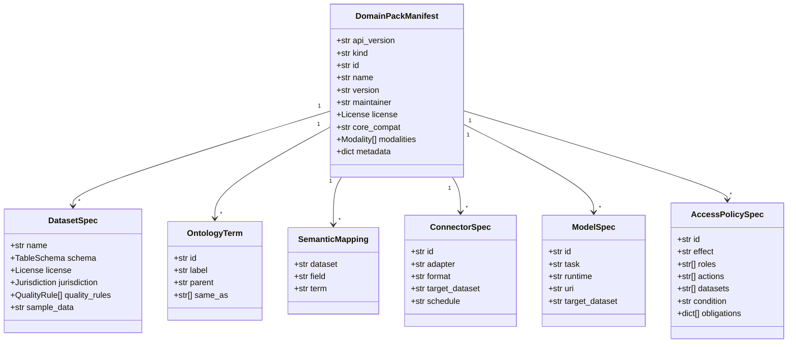
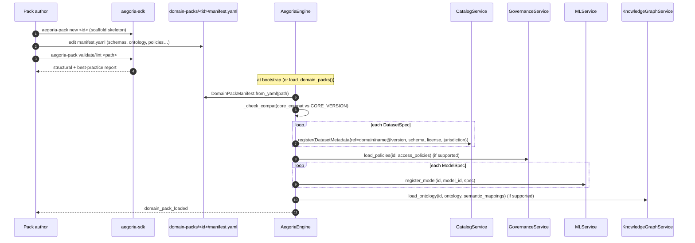

# Aegoria — Domain-Pack Specification

A **domain-pack** is how a brand-new market onboards onto Aegoria **declaratively**,
with **zero edits to the core engine**. It is a portable, versioned plugin that
carries everything Aegoria needs to treat a new market as a first-class
participant — schemas, ontology, semantic mappings, quality rules, ingestion
connectors, ML model references, and default access policy — **as data**.

> The core engine loads a pack; the core engine never changes. *Onboarding a market
> is writing one of these files.* That is the whole point.

This spec is authoritative against the contract in
[`engine/aegoria_core/contracts/domain_pack.py`](../../engine/aegoria_core/contracts/domain_pack.py).
Every field below maps to a Pydantic model there. The two reference packs live in
[`domain-packs/`](../../domain-packs/):
[`climate-emissions/manifest.yaml`](../../domain-packs/climate-emissions/manifest.yaml)
and [`consumer-credit/manifest.yaml`](../../domain-packs/consumer-credit/manifest.yaml).

---

## Anatomy of a pack

```
domain-packs/<id>/
├── manifest.yaml        # the declarative contract — IS the onboarding
├── pack.py              # OPTIONAL Python hooks (custom connectors / models / quality)
├── README.md            # human docs
└── sample_data/         # OPTIONAL bundled sample data referenced by datasets/connectors
```

`manifest.yaml` is loaded by
`DomainPackManifest.from_yaml(path)` and validated by Pydantic. At engine bootstrap,
`AegoriaEngine.load_domain_packs()` discovers every `*/manifest.yaml` under the
configured `domain_pack_paths` (default `./domain-packs`) and loads each one
(filtered by `config.domain_packs` if that list is non-empty).



---

## Manifest fields

### Top-level (`DomainPackManifest`)

| Field | Type | Default | Meaning |
|------|------|---------|---------|
| `api_version` | `str` | `aegoria.dev/v1` | Manifest schema version. |
| `kind` | `str` | `DomainPack` | Resource kind discriminator. |
| `id` | `str` | *required* | Unique pack id, e.g. `climate-emissions`. Becomes the dataset `domain`. |
| `name` | `str` | *required* | Human-readable market name. |
| `version` | `str` | `0.1.0` | Pack version (semver). Stamped onto every dataset's `DatasetRef.version`. |
| `description` | `str` | `""` | What the market is. |
| `maintainer` | `str` | `""` | Owner/contact. Becomes each dataset's `owner`. |
| `license` | `License` | `CC-BY-4.0` | Pack-wide default license. |
| `core_compat` | `str` | `>=0.1.0,<1.0.0` | Semver range of core versions this pack supports. Enforced at load. |
| `modalities` | `Modality[]` | `[]` | Data shapes the pack exercises (advisory / catalog). |
| `datasets` | `DatasetSpec[]` | `[]` | The datasets this market defines. |
| `ontology` | `OntologyTerm[]` | `[]` | The market's vocabulary. |
| `semantic_mappings` | `SemanticMapping[]` | `[]` | Column → ontology-term bindings. |
| `connectors` | `ConnectorSpec[]` | `[]` | Ingestion sources the pack can read. |
| `models` | `ModelSpec[]` | `[]` | Per-domain ML model references. |
| `access_policies` | `AccessPolicySpec[]` | `[]` | Default ABAC/RBAC policy the pack ships. |
| `metadata` | `dict` | `{}` | Free-form; surfaced in the catalog, ignored by the core. |

### Datasets (`DatasetSpec`)

| Field | Type | Default | Meaning |
|------|------|---------|---------|
| `name` | `str` | *required* | Dataset name (unique in the pack). With `id`+`version` forms `DatasetRef`. |
| `title` | `str` | `""` | Display title (falls back to `name`). |
| `description` | `str` | `""` | Description. |
| `modality` | `Modality` | `structured` | Data shape. |
| `schema` | `TableSchema` | *required* | Schema-on-read declaration (note: YAML key `schema`, aliased to `schema_`). |
| `license` | `License` | `CC-BY-4.0` | Per-dataset license override. |
| `jurisdiction` | `Jurisdiction` | `GLOBAL` | Legal home + regulations + residency. |
| `quality_rules` | `QualityRule[]` | `[]` | Rules the core evaluates (never authors). |
| `tags` | `str[]` | `[]` | Catalog tags / search facets. |
| `sample_data` | `str` | `None` | Path/glob to bundled sample data. |

A `TableSchema` is a list of `FieldSchema` (name, `type` from `FieldType`,
`nullable`, `sensitivity`, `pii`, `unit`, `semantic_type`, nested `children`),
plus `primary_key`, `partition_by` and `modality`. See
[`models.py`](../../engine/aegoria_core/contracts/models.py).

### Ontology & semantic mappings (`OntologyTerm`, `SemanticMapping`)

`OntologyTerm` declares a concept (`id`, `label`, optional `parent`, `same_as`
list of external URIs such as FIBO / QUDT / schema.org / SOSA, `description`).
`SemanticMapping` binds a dataset `field` to a term `id` — **this is how raw
columns gain meaning and become interoperable** across markets.

### Connectors (`ConnectorSpec`)

| Field | Type | Default | Meaning |
|------|------|---------|---------|
| `id` | `str` | *required* | Connector id (selected on `ingest`). |
| `modality` | `Modality` | `structured` | Shape of the source data. |
| `adapter` | `str` | `file` | Which ingestion connector adapter to use. |
| `format` | `str` | `csv` | `csv` / `parquet` / `json` / `geojson` / `image` / `kafka` / `api` … |
| `options` | `dict` | `{}` | Connector-specific options. |
| `target_dataset` | `str` | `""` | Which `DatasetSpec` the source feeds. |
| `schedule` | `str` | `None` | Cron-ish hint for orchestration. |

### Models (`ModelSpec`)

| Field | Type | Default | Meaning |
|------|------|---------|---------|
| `id` | `str` | *required* | Model id (registered with the MLService). |
| `task` | `str` | *required* | `anomaly` / `forecast` / `classify` / `verify_content` / `embed`. |
| `runtime` | `str` | `sklearn` | `sklearn` / `onnx` / `torch` / `remote`. |
| `uri` | `str` | `None` | Artifact location (or `pack://…#hook` for a pack hook). |
| `target_dataset` | `str` | `None` | Dataset the model operates on. |
| `params` | `dict` | `{}` | Task params (thresholds, fairness targets, horizons…). |

### Access policies (`AccessPolicySpec`)

| Field | Type | Default | Meaning |
|------|------|---------|---------|
| `id` | `str` | *required* | Policy id (surfaces in `AccessDecision.policy_id`). |
| `description` | `str` | `""` | Why it exists. |
| `effect` | `str` | `allow` | `allow` or `deny` (deny-overrides recommended). |
| `roles` | `str[]` | `[]` | RBAC roles the rule applies to. |
| `actions` | `str[]` | `[]` | `read` / `query` / `sample` / `aggregate` / `export` / `train` / `write` / `admin`. |
| `datasets` | `str[]` | `[]` | Glob over pack datasets (`"*"` = all). |
| `condition` | `str` | `None` | CEL-like ABAC expression over `principal` / `resource` attributes. |
| `obligations` | `dict[]` | `[]` | Conditions to enforce on grant, e.g. `{kind: differential_privacy, params: {...}}`. |

Obligation `kind`s the platform understands (from `models.py`): `mask`,
`tokenize`, `differential_privacy`, `aggregate_only`, `row_filter`, `watermark`,
`residency`.

### Optional Python hooks (`DomainPack` protocol)

A pure-declarative pack needs no code. If a pack ships `pack.py`, it may expose
the optional `DomainPack` protocol hooks — `connectors()` (id → callable producing
Arrow batches), `models()` (id → loaded model object), `custom_quality()`
(rule_id → callable returning a `RuleResult`). **These hooks bind to the same
adapter/service protocols as everything else** — they never reach into the engine.
A `ModelSpec.uri` of the form `pack://<id>/pack.py#<symbol>` points at such a hook
(see `consumer-credit`'s `fair_risk_scorer`).

---

## Annotated example

A minimal, self-contained pack illustrating every section. (The reference packs in
[`domain-packs/`](../../domain-packs/) are the full, production examples.)

```yaml
api_version: aegoria.dev/v1        # manifest schema version
kind: DomainPack
id: maritime-telemetry            # -> dataset domain; must be unique
name: Maritime Vessel Telemetry
version: 0.1.0                     # -> DatasetRef.version on every dataset
description: AIS positions and engine telemetry for commercial vessels.
maintainer: ops@example.org       # -> dataset owner
core_compat: ">=0.1.0,<1.0.0"     # semver range; checked against CORE_VERSION at load
license:                           # pack-wide default license
  spdx_id: CC-BY-4.0
  name: Creative Commons Attribution 4.0

modalities: [time_series, geospatial]

datasets:
  - name: vessel_positions
    title: Vessel Positions (AIS)
    modality: time_series
    tags: [ais, vessel, geospatial]
    sample_data: sample_data/vessel_positions.parquet
    jurisdiction:
      code: GLOBAL
      region: global
      regulations: []
      residency_required: false
    schema:                        # YAML key is `schema` (aliased to schema_)
      name: vessel_positions
      version: 1.0.0
      modality: time_series
      primary_key: [mmsi, observed_at]
      partition_by: [observed_at]
      fields:
        - name: mmsi               # vessel id
          type: string
          nullable: false
          sensitivity: public
          semantic_type: mt:Vessel
        - name: geom               # point geometry, WKT/EPSG:4326
          type: geometry
          nullable: false
          unit: degrees
          sensitivity: public
          semantic_type: mt:Position
        - name: speed_knots
          type: double
          nullable: true
          unit: knots
          sensitivity: public
          semantic_type: mt:Position
        - name: observed_at
          type: timestamp
          nullable: false
          sensitivity: public
          semantic_type: mt:Position
    quality_rules:                 # the core EVALUATES; the pack DECLARES
      - id: vp_mmsi_not_null
        field: mmsi
        kind: not_null
        severity: error
      - id: vp_speed_range
        field: speed_knots
        kind: range
        params: {min: 0.0, max: 60.0}
        severity: warn

ontology:                          # vocabulary aligned to external standards
  - id: mt:Vessel
    label: Vessel
    same_as: [https://schema.org/Vehicle]
  - id: mt:Position
    label: Position
    same_as: [http://www.w3.org/2003/01/geo/wgs84_pos#Point]

semantic_mappings:                 # raw columns -> meaning + interop
  - {dataset: vessel_positions, field: mmsi, term: mt:Vessel}
  - {dataset: vessel_positions, field: geom, term: mt:Position}

connectors:                        # how the pack ingests its own data
  - id: vessel_positions_parquet
    modality: time_series
    adapter: file
    format: parquet
    target_dataset: vessel_positions
    options: {compression: snappy}

models:                            # per-domain ML refs; core stays generic
  - id: speed_anomaly
    task: anomaly
    runtime: sklearn
    target_dataset: vessel_positions
    params: {method: robust_zscore, field: speed_knots, threshold: 3.0}

access_policies:                   # privacy/sovereignty defaults, as data
  - id: open_read
    effect: allow
    roles: [public, analyst]
    actions: [read, query, sample, aggregate]
    datasets: ["*"]
  - id: dp_on_aggregates
    effect: allow
    roles: [analyst]
    actions: [aggregate, query]
    datasets: ["*"]
    obligations:
      - kind: differential_privacy
        params: {epsilon: 1.0, delta: 1.0e-6, mechanism: laplace}

metadata:                          # free-form, catalog-only
  category: logistics
```

---

## How onboarding works, step by step



Concretely, `AegoriaEngine.load_domain_pack(manifest)`
([`engine.py`](../../engine/aegoria_core/engine.py)):

1. **Compatibility check** — `_check_compat` verifies `CORE_VERSION` satisfies
   `manifest.core_compat`; otherwise raises `DomainPackError`.
2. **Datasets → catalog** — each `DatasetSpec` becomes a `DatasetMetadata` with
   `ref = DatasetRef(domain=id, name=ds.name, version=manifest.version)` and is
   registered via `CatalogService.register`.
3. **Access policies → governance** — passed to `GovernanceService.load_policies`
   if the service supports it (best-effort, `hasattr`-gated).
4. **Models → ML** — each `ModelSpec` is registered via `MLService.register_model`.
5. **Ontology → knowledge graph** — `KnowledgeGraphService.load_ontology` if
   supported.

The pack is then in `engine.domain_packs`. Authoring is supported by
[`aegoria-sdk`](../../sdk/aegoria_sdk): `aegoria-pack new` (scaffold),
`validate` (structural correctness), `lint` (validate + advisories), `info`
(human summary). The SDK imports only the frozen `aegoria_core` contracts — it
never touches a concrete adapter or service.

### Ingesting data for a pack

Once loaded, data is ingested with `AegoriaEngine.ingest(domain=, connector=,
source_uri=, dataset=, ...)`. The engine confirms the `domain` is loaded and the
`dataset` is declared (else `DomainPackError`), runs `IngestionService.ingest`
with the dataset's schema, and records an `ingest` lineage edge from the source
connector to the new dataset version.

---

## Versioning & `core_compat`

- **Pack version** (`version`) is semver and is stamped onto every dataset's
  `DatasetRef.version` (`domain/name@version`). Bumping it produces a new dataset
  version line — older versions remain addressable.
- **Core compatibility** (`core_compat`) is a semver *range* declaring which
  engine versions the pack supports. At load, `_check_compat` evaluates
  `Version(CORE_VERSION) in SpecifierSet(core_compat)` (via `packaging`). A
  malformed specifier or an out-of-range core both raise `DomainPackError`. With
  `CORE_VERSION = "0.1.0"`, the reference packs' `>=0.1.0,<1.0.0` accepts the
  whole pre-1.0 core line.
- **Schema evolution** lives inside each `TableSchema.version`; the lakehouse is
  schema-on-read (Iceberg), so additive changes are non-breaking and the catalog
  retains snapshots for time-travel.

---

## How the two reference packs prove neutrality

The platform ships **two deliberately unrelated** markets. They share **zero**
domain code — the only thing in common is the manifest grammar and the engine that
loads them. This is the proof that the core is market-agnostic.

| Dimension | `climate-emissions` | `consumer-credit` |
|----------|--------------------|-------------------|
| Domain | Environment / GHG emissions | Retail lending |
| Modalities | `time_series`, `geospatial`, `imagery`, `sensor_stream` | `structured`, `time_series` |
| Datasets | `facility_emissions`, `sentinel_plumes`, `ground_sensors` | `loan_applications`, `repayment_history` |
| Sensitivity profile | Mostly `public` | `pii`, `financial`, `confidential` |
| Ontology alignment | SOSA, QUDT, schema.org, WGS84 | FIBO, schema.org |
| Jurisdiction | `GLOBAL` (one EU dataset) | `EU`, `residency_required: true`, GDPR + ECOA |
| Default policy posture | Open read + `watermark` obligation; deny anonymous bulk export | Privacy-first: residency deny, mask-PII-unless-owner, DP on every aggregate, analysts aggregate-only |
| Models | `anomaly`, `forecast` (sklearn) | `classify` (fairness-aware), `forecast` (remote pack hooks) |

The decisive point: **the engine never learns the word "borrower" or "methane".**
`consumer-credit`'s GDPR residency boundary, PII masking and differential-privacy
defaults are *declared as obligation data* in
[`consumer-credit/manifest.yaml`](../../domain-packs/consumer-credit/manifest.yaml);
`climate-emissions`'s open-access-with-watermark posture is *declared the same way*
in [`climate-emissions/manifest.yaml`](../../domain-packs/climate-emissions/manifest.yaml).
The same `GovernanceService.authorize` + `apply_obligations` path enforces both
without any domain-specific branching. Onboarding a third, unrelated market
(healthcare, freight, energy markets, …) is writing a third `manifest.yaml` — no
core change, no adapter change.
